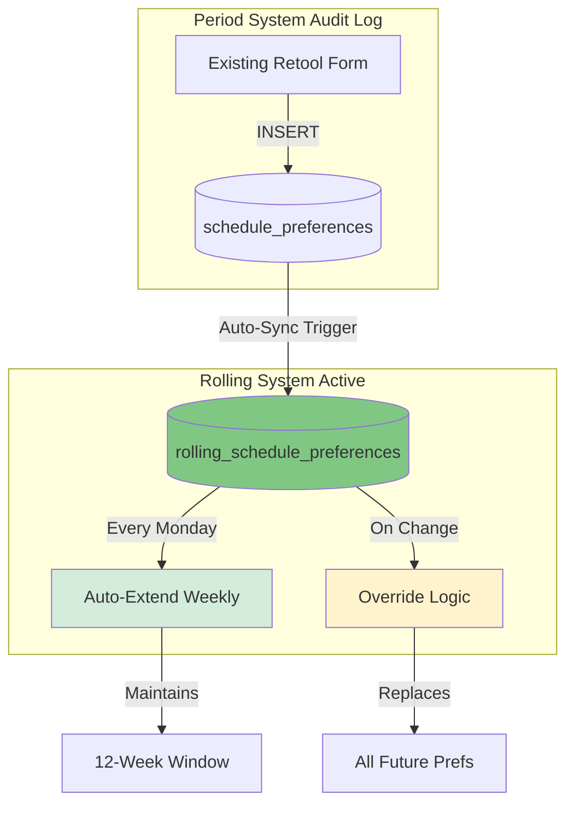

# Coach Schedule Supply System

## 📋 Overview

The **Coach Schedule Supply System** manages coach availability and scheduling preferences using a **12-week rolling window** that automatically extends indefinitely. Coaches submit preferences once and never need to resubmit unless making changes.

---

## 🎯 Key Features

- **Auto-extending preferences** - Set once, rolls forward indefinitely
- **12-week rolling window** - Always see 12 weeks ahead
- **Smart override logic** - Update anytime, replaces all future preferences
- **Zero form changes** - Existing Retool form auto-syncs to rolling system
- **Full audit trail** - Soft-delete history tracks all changes
- **Zero maintenance** - Weekly auto-extend runs automatically

---

## 🏗️ System Architecture



---

## 📅 How It Works

### Auto-Extending Preferences

**Coaches submit once, preferences roll forward indefinitely!**

```
Week 1-12: Coach sets MON_LATE as HARD
    ↓
(Monday - auto-extend runs)
    ↓
Week 2-13: Same preference automatically extended
    ↓
(Continues forever until coach manually changes)
```

### Smart Override Example

```
Initial (Jan 20):
MON_LATE: HARD ─────────────────────> (continues indefinitely)
WED_LATE: PREFERRED ────────────────> (continues indefinitely)

Coach changes WED_LATE to HARD (Feb 10):

Result:
MON_LATE: HARD ─────────────────────> (unchanged)
WED_LATE: PREFERRED ──X (ends Feb 9, inactive)
WED_LATE: HARD ─────────────────────> (Feb 10 forward)
```

### Automatic Sync from Existing Form

**No form changes needed!**

```
1. Coach submits via EXISTING form
2. INSERT into schedule_preferences
3. Trigger fires: sync_to_rolling()
4. Auto-creates rolling preference
5. Begins auto-extending weekly
```

---

## 📊 Database Schema

### Rolling Preferences Table

```sql
CREATE TABLE rolling_schedule_preferences (
    id UUID PRIMARY KEY DEFAULT gen_random_uuid(),
    staff_id UUID NOT NULL REFERENCES staff_database(id),
    period_id UUID REFERENCES schedule_periods(id),
    block TEXT NOT NULL,
    preference_type TEXT NOT NULL,
    effective_date DATE NOT NULL,
    end_date DATE,
    is_active BOOLEAN DEFAULT true,
    superseded_by UUID REFERENCES rolling_schedule_preferences(id),
    created_at TIMESTAMP WITH TIME ZONE DEFAULT NOW(),
    updated_at TIMESTAMP WITH TIME ZONE DEFAULT NOW(),
    coach_name TEXT,
    source TEXT DEFAULT 'manual'
);
```

**Key Fields:**
- `effective_date` - When preference starts
- `end_date` - When it ends (NULL = indefinite)
- `is_active` - Boolean (false = superseded)
- `superseded_by` - Links to new preference
- `source` - `synced`, `migrated`, `manual`, `auto_extended`

---

## 🗓️ Time Blocks

**25 time blocks per week (5 days × 5 time slots):**

- **EARLY**: 6:00 AM - 9:00 AM
- **MID**: 9:00 AM - 12:00 PM
- **LUNCH**: 12:00 PM - 2:00 PM
- **ARVO**: 2:00 PM - 5:00 PM
- **LATE**: 5:00 PM - 8:00 PM

**Examples:** `MON_EARLY`, `TUE_MID`, `WED_LATE`, `THU_LUNCH`, `FRI_ARVO`

---

## 🎯 Preference Types

1. **HARD** - Non-negotiable constraints (must have/must not have)
2. **SOFT** - Strong preferences (can be overridden for business needs)
3. **PREFERRED** - Ideal scenarios (lowest priority)

---

## 📊 Usage Examples

### Query Active Preferences

```sql
SELECT 
    coach_name,
    block,
    preference_type,
    effective_date,
    end_date
FROM rolling_schedule_preferences
WHERE effective_date <= '2026-03-15'
    AND (end_date IS NULL OR end_date >= '2026-03-15')
    AND is_active = true
ORDER BY coach_name, block;
```

### View 12-Week Calendar

```sql
SELECT 
    coach_name,
    block,
    preference_type,
    effective_date
FROM rolling_schedule_preferences
WHERE effective_date <= CURRENT_DATE + INTERVAL '12 weeks'
    AND (end_date IS NULL OR end_date >= CURRENT_DATE)
    AND is_active = true
    AND staff_id = 'COACH_UUID'
ORDER BY effective_date, block;
```

### View Change History

```sql
SELECT 
    coach_name,
    block,
    preference_type,
    effective_date,
    end_date,
    is_active,
    source,
    created_at
FROM rolling_schedule_preferences
WHERE staff_id = 'COACH_UUID'
ORDER BY effective_date DESC;
```

---

## 🎨 Retool Components

### 12-Week Calendar View

```sql
SELECT 
    block,
    preference_type,
    effective_date,
    CASE 
        WHEN preference_type = 'HARD' THEN '#ff5252'
        WHEN preference_type = 'SOFT' THEN '#ffd54f'
        WHEN preference_type = 'PREFERRED' THEN '#81c784'
    END as color
FROM rolling_schedule_preferences
WHERE effective_date BETWEEN CURRENT_DATE AND CURRENT_DATE + INTERVAL '12 weeks'
    AND is_active = true
    AND staff_id = {{ coachSelector.selectedRow.id }}
ORDER BY effective_date, block;
```

---

## 🚀 Implementation Status

✅ **System designed and documented**  
🚧 **Database implementation in progress**

Once deployed:
- All existing preferences migrated
- Auto-extend runs weekly
- Existing forms work unchanged
- Zero-maintenance preferences

---

## 📞 Support

**System Maintainer:** Biomap Operations Team  
**Database:** Supabase (PostgreSQL)  
**Dashboard:** Retool  
**Repository:** [schedule_prediction_supply](https://github.com/towshau/schedule_prediction_supply)

---

**Last Updated:** January 2026  
**Version:** 2.0.0 (Rolling System)
