# Coach Schedule Supply System

## 📋 Overview

The **Coach Schedule Supply System** manages coach availability, scheduling preferences, and capacity allocation for Biomap's coaching operations. This system ensures optimal coach-to-member ratios while respecting individual coach preferences and constraints.

---

## 🎯 Purpose

This system:
- **Captures** coach scheduling preferences (HARD constraints, SOFT preferences, PREFERRED slots)
- **Tracks** coach availability across weekly time blocks
- **Manages** coach capacity (RM ceiling) and current load
- **Optimizes** schedule assignments based on preferences and business needs
- **Monitors** coach utilization and workload distribution

---

## 🏗️ System Architecture


---

## 📊 Database Schema

### Core Tables


---

## 🗓️ Time Block Structure

### Weekly Schedule Grid

The system divides each weekday into **5 time blocks**, creating a **5×5 grid** (25 total blocks per week):


**Time Block Definitions:**
- **EARLY**: Morning sessions (6:00 AM - 9:00 AM)
- **MID**: Mid-morning sessions (9:00 AM - 12:00 PM)
- **LUNCH**: Lunchtime sessions (12:00 PM - 2:00 PM)
- **ARVO**: Afternoon sessions (2:00 PM - 5:00 PM)
- **LATE**: Evening sessions (5:00 PM - 8:00 PM)

---

## 🎯 Preference Types

### Hierarchy of Constraints

```mermaid
graph TD
    A[Schedule Preferences] --> B[HARD Constraints]
    A --> C[SOFT Preferences]
    A --> D[PREFERRED Slots]
    
    B --> B1["❌ Must NOT be scheduled<br/>✅ Must HAVE this slot"]
    C --> C1["⚠️ Would prefer to avoid<br/>👍 Would like to have"]
    D --> D1["⭐ Ideal time slots<br/>🎯 Optimal for coach"]
    
    style B fill:#ffcdd2
    style C fill:#fff9c4
    style D fill:#c8e6c9
```



### Preference Type Definitions

1. **HARD** - Non-negotiable constraints
   - Absolute blockers (e.g., childcare, other commitments)
   - Must-have slots for business continuity
   - Overrides all other considerations

2. **SOFT** - Strong preferences
   - Coach work-life balance preferences
   - Preferred coaching times based on energy levels
   - Can be overridden for business needs

3. **PREFERRED** - Ideal scenarios
   - Optimal coaching slots
   - Best member availability alignment
   - Lowest priority in constraint solving

---

## 📅 Period Management & Defaults

### How Future Periods Work

**When a new period is created:**


### Important Behavior

**Preferences DO NOT automatically carry forward:**
- Each `period_id` is **independent**
- No preferences = **empty schedule** for that period
- Coaches must **re-submit** preferences for each new period
- Previous period preferences remain unchanged

**Why This Design?**
1. **Flexibility** - Coach availability changes between periods
2. **Accuracy** - Forces review of constraints each period
3. **Independence** - Period rollbacks don't affect other periods
4. **Audit Trail** - Clear record of when preferences were submitted

### Querying Preferences by Period

```sql
-- Check if a coach has submitted preferences for a specific period
SELECT 
    s.coach_name,
    COUNT(sp.id) as total_preferences,
    MAX(sp.submitted_at) as last_submission
FROM staff_database s
LEFT JOIN schedule_preferences sp 
    ON s.id = sp.staff_id 
    AND sp.period_id = 'YOUR_PERIOD_ID'
WHERE s.staff_status = 'active'
GROUP BY s.id, s.coach_name
HAVING COUNT(sp.id) = 0;  -- Coaches with NO preferences yet
```

### Best Practices

**For New Periods:**
1. Create the period in advance (2-4 weeks before start)
2. Notify coaches to submit preferences
3. Set submission deadline (1 week before period starts)
4. Validate all HARD constraints before finalizing
5. Run optimization algorithm to generate schedules

**For Preference Copying (Manual Process):**
If you want to copy preferences from a previous period:

```sql
-- Copy preferences from previous period (one-time operation)
INSERT INTO schedule_preferences 
    (staff_id, period_id, block, preference_type, rank, coach_name)
SELECT 
    staff_id,
    'NEW_PERIOD_ID' as period_id,  -- Target period
    block,
    preference_type,
    rank,
    coach_name
FROM schedule_preferences
WHERE period_id = 'PREVIOUS_PERIOD_ID'  -- Source period
    AND staff_id IN (
        SELECT id FROM staff_database WHERE staff_status = 'active'
    );
```

⚠️ **Note:** This is a manual operation and should be used carefully. Coaches should still review and update the copied preferences.

---

## 🔄 Preference Submission Flow


---

## 🔍 Supply-Side Metrics

### Key Performance Indicators


**Metrics Tracked:**
1. **Coach Availability**: Percentage of time blocks with available coaches
2. **Preference Satisfaction**: % of preferences honored in final schedule
3. **Time Block Coverage**: Number of coaches available per time block
4. **Coverage Gaps**: Time blocks with insufficient coach coverage
5. **Constraint Violations**: Number of HARD constraints broken (should be 0)

---

## 🛠️ Setup & Configuration

### Prerequisites

- PostgreSQL 12+ (via Supabase)
- Access to `staff_database`, `schedule_preferences`, `member_memberships`
- Retool account for dashboard/UI

### Database Setup

```sql
-- Verify schedule_preferences table exists
SELECT * FROM information_schema.tables 
WHERE table_name = 'schedule_preferences';

-- Check for existing preferences
SELECT 
    COUNT(*) as total_preferences,
    COUNT(DISTINCT staff_id) as unique_coaches,
    COUNT(DISTINCT period_id) as unique_periods
FROM schedule_preferences;
```

---

## 📊 Usage Examples

### Query Coach Preferences for a Period

```sql
SELECT 
    sp.coach_name,
    sp.block,
    sp.preference_type,
    sp.submitted_at,
    sp.valid
FROM schedule_preferences sp
WHERE sp.period_id = 'YOUR_PERIOD_ID'
    AND sp.valid = 'yes'
ORDER BY sp.coach_name, sp.block;
```

### Find Schedule Conflicts

```sql
WITH hard_blocks AS (
    SELECT 
        staff_id,
        coach_name,
        block,
        COUNT(*) as duplicate_count
    FROM schedule_preferences
    WHERE preference_type = 'HARD'
        AND period_id = 'YOUR_PERIOD_ID'
    GROUP BY staff_id, coach_name, block
    HAVING COUNT(*) > 1
)
SELECT * FROM hard_blocks;
```

### Calculate Coverage by Time Block

```sql
SELECT 
    sp.block,
    COUNT(DISTINCT sp.staff_id) as available_coaches,
    STRING_AGG(sp.coach_name, ', ' ORDER BY sp.coach_name) as coach_list
FROM schedule_preferences sp
JOIN staff_database sd ON sp.staff_id = sd.id
WHERE sp.preference_type IN ('PREFERRED', 'SOFT')
    AND sd.staff_status = 'active'
    AND sp.period_id = 'YOUR_PERIOD_ID'
GROUP BY sp.block
ORDER BY sp.block;
```

### Coach Availability Summary

```sql
SELECT 
    s.coach_name,
    s.role,
    s.rm_ceiling,
    s.home_gym,
    s.tod_coaching,
    COUNT(sp.id) as total_preferences,
    COUNT(CASE WHEN sp.preference_type = 'HARD' THEN 1 END) as hard_constraints,
    COUNT(CASE WHEN sp.preference_type = 'SOFT' THEN 1 END) as soft_preferences,
    COUNT(CASE WHEN sp.preference_type = 'PREFERRED' THEN 1 END) as preferred_slots
FROM staff_database s
LEFT JOIN schedule_preferences sp ON s.id = sp.staff_id 
    AND sp.period_id = 'YOUR_PERIOD_ID'
WHERE s.staff_status = 'active'
    AND s.role IN ('Coach', 'Senior Coach', 'Advanced Coach', 'Head Coach', 'Gym Manager')
GROUP BY s.id, s.coach_name, s.role, s.rm_ceiling, s.home_gym, s.tod_coaching
ORDER BY s.coach_name;
```

---

## 🎨 Retool Dashboard Components

### 1. Coach Preference Calendar

**Component Type:** Calendar or Grid View

**Data Source Query:**
```sql
SELECT 
    sp.id,
    sp.coach_name,
    sp.block,
    sp.preference_type,
    sp.submitted_at,
    CASE 
        WHEN sp.preference_type = 'HARD' THEN '#ff5252'
        WHEN sp.preference_type = 'SOFT' THEN '#ffd54f'
        WHEN sp.preference_type = 'PREFERRED' THEN '#81c784'
    END as color
FROM schedule_preferences sp
WHERE sp.period_id = {{ periodSelector.value }}
    AND sp.staff_id = {{ coachSelector.selectedRow.id }}
ORDER BY sp.block;
```

**Display:**
- Grid layout: Days (columns) × Time Blocks (rows)
- Color-coded by preference type
- Click to view/edit preference details

### 2. Coverage Heatmap

**Component Type:** Plotly Chart (Heatmap)

**Data Transformation:**
```javascript
// Transform data for heatmap
const days = ['MON', 'TUE', 'WED', 'THU', 'FRI'];
const times = ['EARLY', 'MID', 'LUNCH', 'ARVO', 'LATE'];

const coverageData = coverageQuery.data.reduce((acc, row) => {
    const [day, time] = row.block.split('_');
    if (!acc[time]) acc[time] = {};
    acc[time][day] = row.available_coaches;
    return acc;
}, {});

const z = times.map(time => 
    days.map(day => coverageData[time]?.[day] || 0)
);

return [{
    type: 'heatmap',
    x: days,
    y: times,
    z: z,
    colorscale: 'RdYlGn',
    hoverongaps: false
}];
```

---

## 🔧 Optimization Algorithm

### Constraint Satisfaction Approach


**Scoring System:**
- **HARD satisfied**: Required (or reject)
- **SOFT satisfied**: +2 points
- **PREFERRED satisfied**: +1 point
- **Capacity within limits**: Required
- **Coverage gaps**: -5 points per gap

**Optimization Goal:** Maximize total score while maintaining 100% HARD constraint satisfaction and minimum coverage requirements.

---

## 📚 Data Dictionary

### `schedule_preferences` Table

| Column | Type | Description | Example |
|--------|------|-------------|---------|
| `id` | UUID | Unique preference identifier | `c161e14a-0d07-4ce6-9a83-cc3bfc5c267a` |
| `staff_id` | UUID | Foreign key to `staff_database.id` | `1d357192-48b5-4390-a80e-88d68aedf24d` |
| `period_id` | UUID | Foreign key to schedule period | `bceb1735-9c09-440f-9277-b9bce2849839` |
| `block` | ENUM | Time block identifier | `MON_LATE`, `WED_EARLY` |
| `preference_type` | ENUM | Constraint severity | `HARD`, `SOFT`, `PREFERRED` |
| `rank` | INTEGER | Priority ranking (optional) | `1`, `2`, `3` |
| `submitted_at` | TIMESTAMP | Submission datetime | `2026-01-12 00:00:00+00` |
| `status` | TEXT | Processing status | `pending`, `approved`, `rejected` |
| `valid` | ENUM | Validation flag | `yes`, `no` |
| `coach_name` | TEXT | Coach name (denormalized) | `Aaron Kidd` |

### Time Blocks (25 total)

| Pattern | Examples |
|---------|----------|
| `{DAY}_EARLY` | `MON_EARLY`, `TUE_EARLY`, `WED_EARLY`, `THU_EARLY`, `FRI_EARLY` |
| `{DAY}_MID` | `MON_MID`, `TUE_MID`, `WED_MID`, `THU_MID`, `FRI_MID` |
| `{DAY}_LUNCH` | `MON_LUNCH`, `TUE_LUNCH`, `WED_LUNCH`, `THU_LUNCH`, `FRI_LUNCH` |
| `{DAY}_ARVO` | `MON_ARVO`, `TUE_ARVO`, `WED_ARVO`, `THU_ARVO`, `FRI_ARVO` |
| `{DAY}_LATE` | `MON_LATE`, `TUE_LATE`, `WED_LATE`, `THU_LATE`, `FRI_LATE` |

---

## 🚀 Features

- ✅ **Multi-period scheduling** - Support for multiple scheduling periods
- ✅ **Hierarchical preferences** - HARD, SOFT, PREFERRED constraint types
- ✅ **Capacity tracking** - Real-time RM ceiling and utilization monitoring
- ✅ **Conflict detection** - Automatic identification of scheduling conflicts
- ✅ **Coverage analysis** - Identify gaps in time block coverage
- ✅ **Audit trail** - Track preference submissions and changes
- ✅ **Coach analytics** - Detailed utilization and workload metrics

---

## 🔮 Future Enhancements

1. **Automated Scheduling Engine**
   - Constraint satisfaction solver
   - Genetic algorithm for optimization
   - Machine learning for preference prediction

2. **Mobile Preference Submission**
   - iOS/Android app integration
   - Push notifications for schedule changes
   - Real-time availability updates

3. **Advanced Analytics**
   - Predictive capacity modeling
   - Member-coach matching optimization
   - Burnout risk detection

4. **Integration Modules**
   - Calendar sync (Google, Outlook)
   - Member booking system integration
   - Automated shift swap marketplace

---

## 🤝 Contributing

This is an internal Biomap system. For questions or suggestions:

1. Submit issues via the GitHub issue tracker
2. Contact the operations team for access requests
3. Follow internal code review processes for changes

---

## 📞 Support

**System Maintainer:** Biomap Operations Team  
**Database:** Supabase (PostgreSQL)  
**Dashboard:** Retool  
**Repository:** [schedule_prediction_supply](https://github.com/towshau/schedule_prediction_supply)

---

## 📄 License

Internal use only - Biomap proprietary system

---

**Last Updated:** January 2026  
**Version:** 1.0.0
